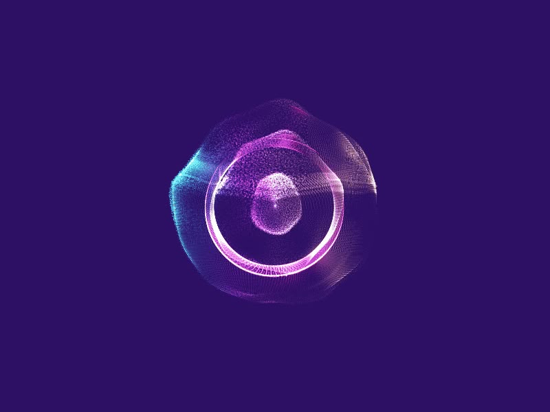

# tut5_GroupB_meli0324

## Audio-Driven Visual Animation System

### Project Overview  
This project is a dynamic visual animation based on **p5.js** and audio frequency analysis.  
When users open the page and press the **spacebar**, background music starts playing and the animation begins.  
Press the **spacebar** again to pause.  
The visuals keep changing in real-time based on the music's audio frequency data, creating a rhythmic and lively experience.

### How to Use

- Open the page and press `spacebar` to start the music and animation  
- Press `spacebar` again to pause  
- The visuals will keep updating based on the music automatically — no need for manual control

### Technical Details

- Built with the `p5.js` framework  
- Uses `p5.FFT()` to analyze the `"mid"` range of audio frequencies  
- Maps the audio energy to visual properties using the `map()` function:
  - The size and transparency of expanding rings at the bottom  
  - The speed and number of rotating dots  
  - The length of the radial spikes

- Two main classes are used:
  - `PatternCircle`: draws the central pattern and dot grid  
  - `ExpandingCircle`: creates expanding rings when the beat gets stronger, simulating sound waves

- Object-oriented structure is used to make the code cleaner and easier to update

### Visual Design Highlights

- The main visual is based on circular patterns, showing the rhythm of the music  
- The dot grid rotates and reacts to the music, creating a breathing effect  
- Animation changes in real-time with the mid-frequency energy  
- The main color theme is blue and purple, giving a modern, tech-inspired look  
- Compared to my teammates:
  - One focused on using Bézier curves and scale changes  
  - Another tried to make tail effects with the dots  
  - My version focuses on a combination of expanding ripple effects and dynamic dots to show the changes in rhythm and intensity

### Inspiration

- Inspired by tech-style motion graphics, such as:
  - Circular audio visualizers where shapes grow and shrink with frequency
  

- These examples inspired me to use layers of animation like ripples, rotation, transparency changes, and color shifts to make the visuals feel alive with the music

### Improvements and Changes

- Rewrote the central pattern drawing logic  
- Adjusted animation details for smoother rhythm response  
- Updated color scheme and visual layers for a consistent style  
- Cleaned up code structure to make it easier to expand and maintain
